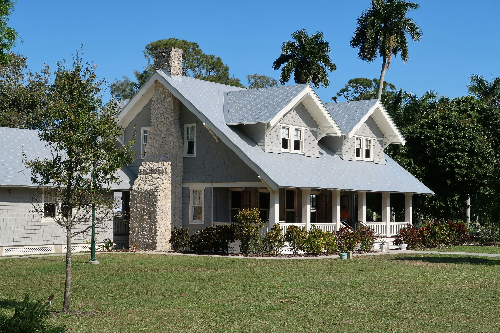

# GoldenCity

**The real estate sector is changing rapidly as new technologies like cryptocurrencies and AR/VR are developed, it is important to understand how these technologies and existing real estate markets work.  Developing a responsive real estate platform, a digital housing marketplace, using ReactJS.**

## What is GoldenCity?

**The proposed real estate platform - GoldenCity will serve as a digital marketplace where users can seamlessly browse, display, and purchase properties using advanced technologies such as Augmented Reality (AR) and Virtual Reality (VR), alongside Web3 capabilities. By integrating blockchain technology, the platform will ensure secure transactions and ownership verification. This innovative solution aims to revolutionize the real estate experience for buyers, sellers, and agents.**




## Enhancements Added

I've made several enhancements to the original GoldenCity project:

### Performance Optimizations
- **React Best Practices**: Implemented `useMemo` hooks for expensive calculations
- **Lazy Loading**: Added code splitting with React.lazy for improved loading performance
- **Optimized useEffect**: Refined dependencies and added proper cleanup functions

### Routing Architecture Improvements
- **React Router**: Replaced `<a>` tags with React Router's `Link` and `NavLink` components
- **Nested Routing**: Implemented outlet pattern for better component organization
- **Router Configuration**: Refactored App.jsx router setup

### UI/UX Enhancements
- **Responsive Design**: Improved responsiveness across all device sizes
- **Navigation Menu**: Enhanced with smooth hover effects and clear active states
- **Error Page**: Created a professional 404 page matching the gold theme
- **3D Visualization**: Added an interactive 3D building component

### Other Improvements
- **Docker Support**: Added Docker and docker-compose configuration
- **Code Organization**: Improved component structure

## Run Locally

Install dependencies

```bash
  npm install
  node version 18
```

# Build and run with docker-compose
docker compose up --build